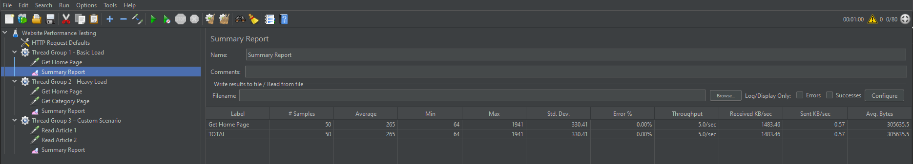

# BÀI TẬP KIỂM THỬ PHẦN MỀM

---

## Bài 1: Đánh giá lần đầu trên trang Can't Unsee

Hình ảnh kết quả đánh giá giao diện người dùng trên website Can't Unsee:


---

## Bài 2: Thực hành kiểm thử đơn vị với JUnit

## 1. Mô tả bài toán

Xây dựng chương trình Java để phân tích dữ liệu điểm số của học sinh, bao gồm hai chức năng chính:

- `countExcellentStudents(List<Double> scores)`  
  Đếm số học sinh có điểm từ 8.0 trở lên (excellent).

- `calculateValidAverage(List<Double> scores)`  
  Tính điểm trung bình của các điểm hợp lệ trong danh sách.  
  Điểm hợp lệ nằm trong khoảng từ 0 đến 10.  
  Nếu danh sách rỗng hoặc không có điểm hợp lệ thì trả về 0.

---

## 2. Các kỹ thuật thiết kế test case

Trong lớp `StudentAnalyzerTest`, các test case được thiết kế dựa trên ba kỹ thuật kiểm thử hộp đen phổ biến:

- Phân vùng tương đương (Equivalence Partitioning)
- Phân tích giá trị biên (Boundary Value Analysis – BVA)
- Kiểm thử dựa trên bảng quyết định (Decision Table Testing)

---

## 2.1. Phân vùng tương đương (Equivalence Partitioning)

Miền dữ liệu đầu vào được chia thành các lớp tương đương sau:

### Đối với giá trị điểm số
- Điểm hợp lệ: 0 ≤ score ≤ 10
- Điểm không hợp lệ: score < 0 hoặc score > 10
- Điểm excellent: score ≥ 8.0

### Đối với danh sách điểm
- Danh sách rỗng
- Danh sách không rỗng

Mỗi lớp tương đương được đại diện bởi ít nhất một test case nhằm đảm bảo hành vi của chương trình được kiểm tra đầy đủ mà không cần kiểm thử mọi giá trị có thể.

Các test case trong lớp `StudentAnalyzerTest` đã bao phủ đầy đủ các lớp tương đương này, bao gồm:
- Chỉ chứa điểm hợp lệ
- Chỉ chứa điểm không hợp lệ
- Kết hợp điểm hợp lệ và không hợp lệ
- Danh sách rỗng

---

## 2.2. Phân tích giá trị biên (Boundary Value Analysis – BVA)

Các test case được thiết kế để kiểm tra các giá trị tại ranh giới của miền dữ liệu hợp lệ:

- Giá trị nhỏ nhất hợp lệ: 0.0
- Giá trị lớn nhất hợp lệ: 10.0
- Giá trị ngay dưới biên dưới: -1.0
- Giá trị ngay trên biên trên: 11.0
- Biên phân loại excellent: 8.0

Ngoài ra, các giá trị gần biên cũng được kiểm thử như:
- Min + 1 (1.0)
- Max − 1 (9.0)

Việc kiểm thử tại các giá trị biên giúp phát hiện các lỗi thường xảy ra ở ranh giới miền dữ liệu.

---

## 2.3. Kiểm thử bảng quyết định (Decision Table Testing)

### Decision Table cho phương thức `calculateValidAverage`

#### Điều kiện
- C1: Danh sách rỗng?
- C2: Có ít nhất một điểm hợp lệ?

#### Hành động
- A1: Trả về trung bình các điểm hợp lệ
- A2: Trả về 0

| Rule | Danh sách rỗng | Có điểm hợp lệ | Kết quả |
|------|---------------|---------------|---------|
| R1   | Không         | Có            | A1      |
| R2   | Không         | Không         | A2      |
| R3   | Có            | Không         | A2      |

---

### Decision Table cho phương thức `countExcellentStudents`

#### Điều kiện
- C1: Danh sách rỗng?
- C2: Có điểm excellent (≥ 8.0)?

#### Hành động
- A1: Đếm số lượng học sinh excellent
- A2: Trả về 0

| Rule | Danh sách rỗng | Có excellent | Kết quả |
|------|---------------|--------------|---------|
| R1   | Không         | Có           | A1      |
| R2   | Không         | Không        | A2      |
| R3   | Có            | Không        | A2      |

Mỗi test case được thiết kế để đại diện cho một rule cụ thể trong bảng quyết định, giúp thể hiện rõ mối quan hệ giữa điều kiện đầu vào và hành vi của hệ thống.

---

## 3. Kết luận

Bộ test trong dự án đã:

- Áp dụng đầy đủ kỹ thuật phân vùng tương đương
- Kiểm tra chi tiết các giá trị biên quan trọng
- Thể hiện rõ logic nghiệp vụ thông qua kiểm thử bảng quyết định

Nhờ đó, chương trình được kiểm thử toàn diện, dễ hiểu và phù hợp với yêu cầu học thuật của môn Kiểm thử phần mềm.

---

## 4. Hướng dẫn chạy test

### Chạy bằng IDE
Sử dụng chức năng Run Test trong Visual Studio Code hoặc IntelliJ IDEA.

### Chạy bằng dòng lệnh
```bash
mvn test

```
---

## Bài 3: Bài tập thực hành kiểm thử tự động End-to-End với Cypress

### 1. Mục tiêu

* Hiểu và thực hành kiểm thử tự động End-to-End (E2E)
* Làm quen với Cypress và cách tổ chức test case
* Kiểm thử các chức năng phổ biến của website thương mại điện tử

---

### 2. Yêu cầu môi trường

* Node.js **>= 14**
* Visual Studio Code (hoặc IDE tương đương)
* Truy cập được website mẫu: **[https://www.saucedemo.com](https://www.saucedemo.com)**

---

### 3. Công nghệ sử dụng

| Thành phần   | Công nghệ                                              |
| ------------ | ------------------------------------------------------ |
| Ngôn ngữ     | JavaScript                                             |
| Nền tảng     | Node.js                                                |
| Công cụ E2E  | Cypress                                                |
| Website test | [https://www.saucedemo.com](https://www.saucedemo.com) |

---

### 4. Cài đặt Cypress

```bash
mkdir cypress-exercise
cd cypress-exercise
npm init -y
npm install cypress --save-dev
npx cypress open
```

Sau lần chạy đầu tiên, Cypress sẽ tự động tạo thư mục `cypress/`.

---

### 5. Cấu trúc thư mục

```text
cypress-exercise/
├── cypress/
│   └── e2e/
│       ├── login_spec.cy.js
│       └── cart_spec.cy.js
├── cypress.config.js
├── package.json
└── README.md
```

---

### 6. Các kịch bản kiểm thử

#### 6.1. Kiểm thử đăng nhập thành công

```javascript
cy.visit('https://www.saucedemo.com');
cy.get('#user-name').type('standard_user');
cy.get('#password').type('secret_sauce');
cy.get('#login-button').click();
cy.url().should('include', '/inventory.html');
```

---

#### 6.2. Kiểm thử đăng nhập thất bại

```javascript
cy.get('.error-message-container')
  .should('contain', 'Username and password do not match');
```

---

#### 6.3. Kiểm thử thêm sản phẩm vào giỏ hàng

```javascript
cy.get('.inventory_item').first().find('.btn_inventory').click();
cy.get('.shopping_cart_badge').should('have.text', '1');
```

---

#### 6.4. Kiểm thử sắp xếp sản phẩm theo giá (Low → High)

```javascript
cy.get('.product_sort_container').select('lohi');
cy.get('.inventory_item_price').first().should('have.text', '$7.99');
```

---

#### 6.5. Kiểm thử xóa sản phẩm khỏi giỏ hàng

```javascript
cy.get('.btn_inventory').first().click();
cy.get('.btn_inventory').first().click();
cy.get('.shopping_cart_badge').should('not.exist');
```

---

#### 6.6. Kiểm thử quy trình thanh toán (Checkout)

```javascript
cy.get('.shopping_cart_link').click();
cy.get('#checkout').click();
cy.get('#first-name').type('John');
cy.get('#last-name').type('Doe');
cy.get('#postal-code').type('12345');
cy.get('#continue').click();
cy.url().should('include', '/checkout-step-two.html');
```

---

### 7. Hướng dẫn chạy kiểm thử

```bash
npx cypress open
```

Chọn file `login_spec.cy.js` hoặc `cart_spec.cy.js` để chạy test.

---

### 8. Kết quả đạt được

* Thực hiện thành công các kịch bản kiểm thử End-to-End
* Hiểu rõ luồng kiểm thử UI tự động với Cypress
* Ghi lại kết quả chạy test (ảnh chụp màn hình / video) để nộp bài

---

### 9. Video chạy kiểm thử

[Xem video chạy kiểm thử End-to-End với Cypress](Bai3/test_bai_3.mp4)

---

## Bài 3: BÁO CÁO KIỂM THỬ HIỆU NĂNG WEBSITE BẰNG APACHE JMETER

---

### 1. Thông tin chung
- Công cụ kiểm thử: Apache JMeter
- Phiên bản: 5.6.3
- Website kiểm thử: https://vnexpress.net
- Mục tiêu: Kiểm thử hiệu năng và khả năng chịu tải của website

---

### 2. Mục tiêu bài kiểm thử
- Làm quen với công cụ Apache JMeter
- Thiết kế Test Plan với nhiều Thread Group
- Đo lường thời gian phản hồi, throughput và tỉ lệ lỗi
- Xuất kết quả kiểm thử ra file CSV
- Phân tích và đánh giá kết quả kiểm thử

---

### 3. Mô tả Test Plan
Test Plan bao gồm **3 Thread Group**, mỗi Thread Group mô phỏng một kịch bản tải khác nhau.

File Test Plan:  
`performance_test.jmx`

---

### 4. Cấu hình các Thread Group

#### 4.1 Thread Group 1 – Basic Load Test
- Number of Threads (Users): 10
- Ramp-up Period: 5 giây
- Loop Count: 5
- HTTP Request:
  - GET https://vnexpress.net

**Ảnh cấu hình Thread Group 1:**



**Mục đích:**  
Kiểm tra khả năng phản hồi của website khi có số lượng người dùng thấp.

---

#### 4.2 Thread Group 2 – Heavy Load Test
- Number of Threads (Users): 50
- Ramp-up Period: 30 giây
- Loop Count: 1
- HTTP Request:
  - GET https://vnexpress.net

**Ảnh cấu hình Thread Group 2:**


**Mục đích:**  
Đánh giá khả năng chịu tải của website khi số lượng người dùng tăng cao.

---

#### 4.3 Thread Group 3 – Custom Scenario
- Number of Threads (Users): 20
- Ramp-up Period: 10 giây
- Loop Count: Forever
- Duration: 60 giây
- HTTP Request:
  - GET https://vnexpress.net

**Ảnh cấu hình Thread Group 3:**


**Mục đích:**  
Mô phỏng hành vi người dùng truy cập website liên tục trong một khoảng thời gian.

---

### 5. Kết quả kiểm thử

Kết quả được thu thập thông qua **Summary Report** và xuất ra file CSV.

#### 5.1 Kết quả Thread Group 1
- Thời gian phản hồi trung bình: ~265 ms
- Thời gian phản hồi lớn nhất: ~1941 ms
- Throughput: ~5 requests/giây
- Error Rate: 0.00%

File kết quả: `summary_threadgroup1.csv`

---

#### 5.2 Kết quả Thread Group 2
- Thời gian phản hồi trung bình: ~422 ms
- Thời gian phản hồi lớn nhất: ~1662 ms
- Throughput: ~3.3 requests/giây
- Error Rate: 0.00%

File kết quả: `summary_threadgroup2.csv`

---

#### 5.3 Kết quả Thread Group 3
- Thời gian phản hồi trung bình: ~509 ms
- Thời gian phản hồi lớn nhất: ~2017 ms
- Throughput: ~36 requests/giây
- Error Rate: 0.00%

File kết quả: `summary_threadgroup3.csv`

---

### 6. Đánh giá và nhận xét
- Website vnexpress.net hoạt động ổn định trong cả 3 kịch bản
- Không ghi nhận lỗi trong quá trình kiểm thử
- Thời gian phản hồi tăng khi số lượng người dùng tăng
- Website có khả năng phục vụ nhiều người dùng đồng thời

---

### 7. Kết luận
Apache JMeter là công cụ hiệu quả để kiểm thử hiệu năng website.  
Bài kiểm thử giúp đánh giá được khả năng phản hồi và chịu tải của hệ thống trong các điều kiện khác nhau.

---

### 8. Tài nguyên đính kèm
- Test Plan: `performance_test.jmx`
- File kết quả CSV: thư mục `results/`
- Ảnh cấu hình Thread Group: thư mục `images/`
